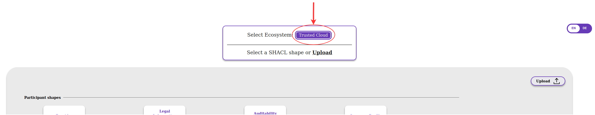
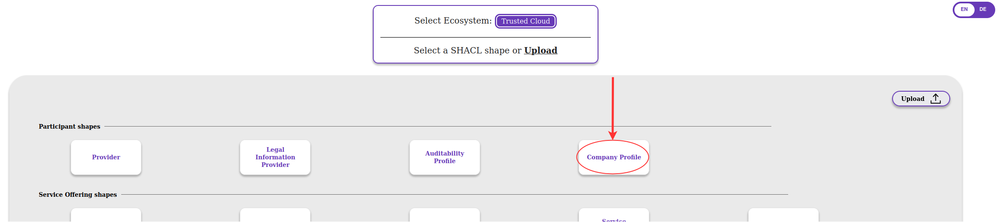
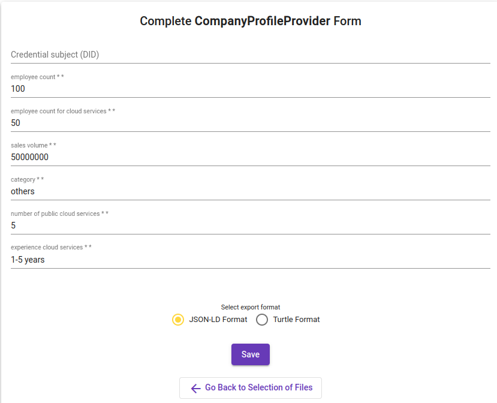

## Generating Self Description Files

So far, the classes and attributes have only been described in a class diagram. As the self descriptions need to be validated, [JSON-LD](https://www.w3.org/TR/json-ld11/) files need to be generated.
The recommended way is the usage of the [Creation Wizard](https://sd-creation-wizard.gxfs.dev), either by uploading a `SHACL Shape` or by filling in the desired data. The data from the previous section can be used as input data for the latter, which is shown in the following on the example of the class **companyProfile**.

First, the Ecosystem *Trusted Cloud* is selected:

In the next step, the form *Company Profile* is chosen:

In the last step, the data as shown in the class diagram is used to define the company profile. The JSON-LD file is generated at the end.

