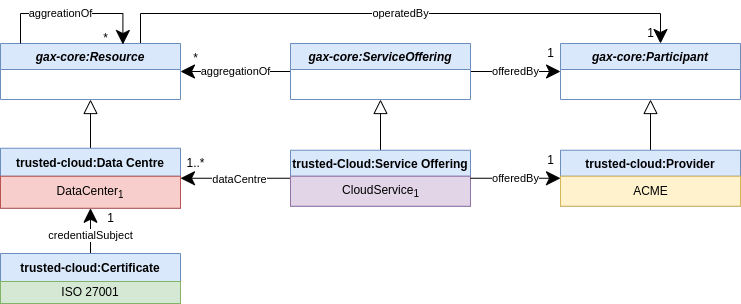
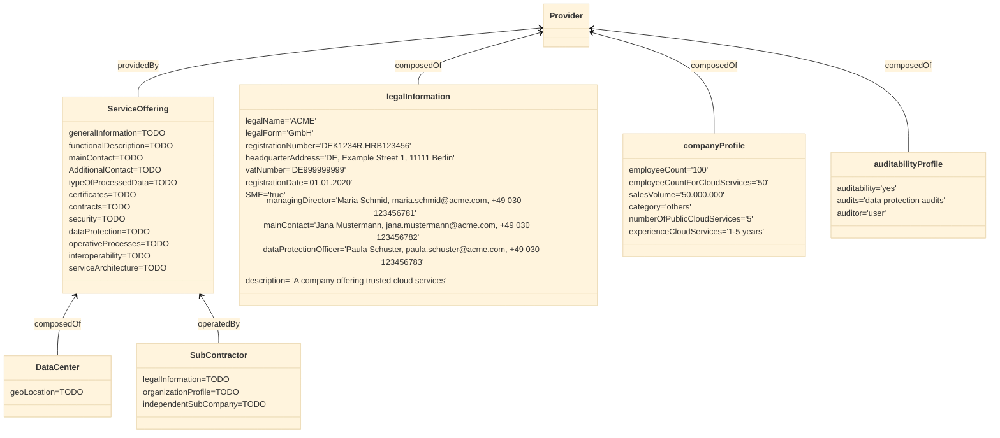

# Tutorial on how to create Self Descriptions for a Trusted Cloud Spec

In the following, the creation and resulting validation of self descriptions for [Trusted Cloud Spec](https://www.trusted-cloud.de/sites/default/files/trusted_cloud_kriterienkatalog_v2_0_en_final_1.pdf) is described step by step.

## Use Case

The Cloud Service Provider **ACME** wants to offer **CloudService<sub>1</sub>** on the Gaia-X Marketplace. It uses one data center (**DataCenter<sub>1</sub>**) which is owned by **SubContractor<sub>1</sub>** and certified by **ISO 27001**.

## Mapping of the Use Case onto top-level classes

To get started with defining self descriptions, we recommend to map the use case to the top-level classes of Self-Description Schema. This will help you to identify all entities for which a self description is required.

The Trusted Cloud Self-Description Model extends the Gaia-X Core Self-Description Model and has four top level classes: (1) *trusted-cloud:Provider*, (2) *trusted-cloud:ServiceOffering*, (3) *trusted-cloud:DataCentre*, and *trusted-cloud:Certificate*.

ACME is a **trusted-cloud:Provider** (which is a subtype of **gax-core:Participant**) in this scenario and its CloudService<sub>1</sub> is a **trusted-cloud:ServiceOffering**, a sub-class of the Gaia-X Core Self-Description Model **gax-core:ServiceOffering**.
The CloudService<sub>1</sub> itself is composed by **DataCenter<sub>1</sub>** an instance of class  **trusted-cloud:DataCenter**, which is subclass of **gax-core:Resource**.
The DataCenter<sub>1</sub> is certified by ISO 27001, which is mapped to an instance of class **trusted-cloud:Certificate**.
SubContractor<sub>1</sub> can be modeled either as instance of **trusted-cloud:Provider** or as complex attribute of class **trusted-cloud:DataCenter**. This tutorial chooses the second option and models  SubContractor<sub>1</sub> as attribute.




## Definition of Self Descriptions

A Self Description is a [W3C Verifiable Presentation (VP)](https://www.w3.org/TR/vc-data-model/) consisting of a set of Verifiable Credentials (VC). Each class in Self-Description Schema defines a special class of Verifiable Credential. It is up to the author of a Self-Description to choose which VCs should be part of a specific Self-Description.

Based on the findings from the previous section, the VCs for this scenario can be defined accordingly. Each VC is modeled as a separat object and has two additional attributes, called **did** and **credentialSubject**, which are not defined in the SD schema. These attributes come from W3C definition of Verifiable Credentials:

- **DID**: Decentralized Identifier is a unique string identifying this VC
- **credentialSubject**: a DID defining the subject this VC makes statements about

The following diagram shows the self-description of *ACME* as a trusted-cloud:Provider, consisting of three Verifiable Credentials: (1) LegalInformation, (2) CompanyProfile, and (3) AuditabilityProfile. In favor of readability, we omit prefix "trusted-cloud:" for each class. As VCs have to be signed, we added the issuer as last line to the class. Please note that there are VCs which are signed by the credential subject itself and VCs, which are signed by a trustworthy third party.

```mermaid
%%{init: {'theme':'base'}}%%

classDiagram


Provider --> LegalInformation: legalInformation
Provider --> CompanyProfile: companyProfile
Provider --> AuditabilityProfile: auditabilityProfile

class Provider {
    did='1234567890'
    credentialSubject='1234567890'
    }


class LegalInformation {
    did='1234567891'
    credentialSubject='1234567890'
    legalName='ACME'
    legalForm='GmbH'
    registrationNumber='DEK1234R.HRB123456'
    headquarterAddress='DE, Example Street 1, 11111 Berlin'
    vatNumber='DE999999999'
    registrationDate='01.01.2020'
    SME='true'
    managingDirector='Maria Schmid, maria.schmid@acme.com, +49 030 123456781'
    mainContact='Jana Mustermann, jana.mustermann@acme.com, +49 030 123456782'
    dataProtectionOfficer='Paula Schuster, paula.schuster@acme.com, +49 030 123456783'
    description= 'A company offering trusted cloud services'

    (singed by Notarization Service)
    }

class CompanyProfile {
    did='1234567892'
    credentialSubject='1234567890'
    employeeCount='100'
    employeeCountForCloudServices='50'
    salesVolume='50.000.000'
    category='others'
    numberOfPublicCloudServices='5'
    experienceCloudServices='1-5 years'

    (signed by ACME)
    }

class AuditabilityProfile {
    did='1234567893'
    credentialSubject='1234567890'
    auditability='yes'
    audits='data protection audits'
    auditor='user'
    (signed by ACME)
}


```

Please note: All three VCs reference the same DID as credential subject. This did belongs to ACME, which means all VCs making statements about the same subject, the Trusted Cloud Provider AMCE, in this case.

The following diagram shows the definition of *DataCenter<sub>1</sub>* and *SubContractor<sub>1</sub>* as well as the one for *ISO 27001* certificate.


```mermaid
%%{init: {'theme':'base'}}%%

classDiagram


SubContractor --> LegalInformationSubContractor: legalInformation
SubContractor --> CompanyProfileSubContractor: companyProfile
DataCentre --> SubContractor: "operatedBy"
Certificate --> DataCentre : "credentialObject"


class DataCentre {
    did='2234567891'
    geoLocation='Germany, Berlin'
    }


class SubContractor {
    did='2234567890'
    credentialSubject='2234567890'
    }


class LegalInformationSubContractor {
    did='1234567891'
    credentialSubject='1234567890'
    legalName='SubContractor1'
    legalForm='AG'
    registrationNumber='DEK2234R.HRB123456'
    headquarterAddress='DE, Example Street 2, 11111 Berlin'
    vatNumber='DE999999990'
    registrationDate='01.01.2021'
    SME='true'
    managingDirector='Olaf Mueller, olaf.mueller@sc1.com, +49 030 123456781'
    mainContact='Jens Mustermann, jens.mustermann@sc1.com, +49 030 123456782'
    dataProtectionOfficer='Paula Schuster, paula.schuster@acme.com, +49 030 123456783'
    description= 'A company offering trusted data centers'
    independentSubCompany='yes'

    (signed by ACME)
    }

class CompanyProfileSubContractor {
    did='2234567892'
    credentialSubject='2234567890'
    employeeCount='100'
    salesVolume='100.000.000'
    category='Cloud Service Provider'
    numberOfPublicCloudServices='5'
    experienceCloudServices='1-5 years'

    (signed by ACME)
    }


class Certificate{
    did='2234567890'
    name='Iso 27001'
    type='ISO 27001'
    expirationDate='31.12.2025'
    regularAudited='yes'

    (signed by TÜV)
}

```

Specifically, originating from the class **trusted-cloud:Provider**, the related classes and necessary attributes are shown. Further classes emerging from that are left out but would be defined in the same manner (marked with the keyword 'TODO' in the class diagram). For the previously described classes **DataCenter** and **SubContractor**, only the relationships to the class **Provider** is shown (leaving out subclasses and attributes).
In the end, each class results in a separate self description file, referencing other classes where needed.



## Generating Self Description Files

So far, the classes and attributes have only been described in a class diagram. As the self descriptions need to be validated, [JSON-LD](https://www.w3.org/TR/json-ld11/) files need to be generated.
The recommended way is the usage of the [Creation Wizard](https://sd-creation-wizard.gxfs.dev), either by uploading a `SHACL Shape` or by filling in the desired data. The data from the previous section can be used as input data for the latter, which is shown in the following on the example of the class **companyProfile**.

First, the Ecosystem *Trusted Cloud* is selected:


In the next step, the form *Company Profile* is chosen:


In the last step, the data as shown in the class diagram is used to define the company profile. The JSON-LD file is generated at the end.


The resulting JSON-LD file is the following:

```json-ld
{
  "@context": {
    "cc": "http://creativecommons.org/ns#",
    "schema": "http://schema.org/",
    "void": "http://rdfs.org/ns/void#",
    "owl": "http://www.w3.org/2002/07/owl#",
    "xsd": "http://www.w3.org/2001/XMLSchema#",
    "trusted-cloud": "http://w3id.org/gaia-x/trusted-cloud#",
    "gax-validation": "http://w3id.org/gaia-x/validation#",
    "skos": "http://www.w3.org/2004/02/skos/core#",
    "voaf": "http://purl.org/vocommons/voaf#",
    "rdfs": "http://www.w3.org/2000/01/rdf-schema#",
    "vcard": "http://www.w3.org/2006/vcard/ns#",
    "gax-core": "http://w3id.org/gaia-x/core#",
    "dct": "http://purl.org/dc/terms/",
    "sh": "http://www.w3.org/ns/shacl#",
    "rdf": "http://www.w3.org/1999/02/22-rdf-syntax-ns#",
    "ids": "https://w3id.org/idsa/core/",
    "dcat": "http://www.w3.org/ns/dcat#",
    "vann": "http://purl.org/vocab/vann/",
    "foaf": "http://xmlns.com/foaf/0.1/",
    "did": "https://www.w3.org/TR/did-core/#"
  },
  "@id": "did:web:registry.gaia-x.eu:CompanyProfileProvider:QzDDkop5VOSE-tgo9ILYdJIkpIMcDsqxo0P3/CompanyProfileProvider-ssdmg39r6xr0x8b55su0dba",
  "@type": "trusted-cloud:CompanyProfileProvider",
  "trusted-cloud:employeeCount": {
    "@value": "100",
    "@type": "xsd:nonNegativeNumber"
  },
  "trusted-cloud:employeeCountForCloudServices": {
    "@value": "50",
    "@type": "xsd:nonNegativeNumber"
  },
  "trusted-cloud:salesVolume": {
    "@value": "50000000",
    "@type": "xsd:nonNegativeNumber"
  },
  "trusted-cloud:category": "others",
  "trusted-cloud:numberOfPublicCloudServices": {
    "@value": "5",
    "@type": "xsd:nonNegativeNumber"
  },
  "trusted-cloud:experienceCloudServices": "1-5 years"
}
```


## Validation of Self Descriptions

A self description can be used in the form of a *[Verifiable Presentation](https://www.w3.org/TR/vc-data-model/#dfn-verifiable-presentations)*.
For that, a *[Verifiable Credential]((https://www.w3.org/TR/vc-data-model/#dfn-verifiable-credentials))* has to be issued from a [Trust Anchor](https://docs.gaia-x.eu/policy-rules-committee/trust-framework/latest/trust_anchors/). A *Verifiable Credential* contains one or more claims about a GAIA-X entity and metadata, together with a proof from the issuer, such as a digital signature. Due to that, a *Verifiable Credential* is tamper-evident.
A *[Verifiable Presentation](https://www.w3.org/TR/vc-data-model/#dfn-verifiable-presentations)* may contain information regarding one or more *Verifiable Credentials* and is tamper proof as well.
In the context of Gaia-X, such a *Verifiable Presentation* is checked against a known set of SHACL-shapes. The output is a *Verifiable Credential* containing the *id* and *hash* of the compliant *VerifiableCredential* from the input.
Further information can be found [here](https://gaia-x.gitlab.io/technical-committee/federation-services/self-description-model/).
