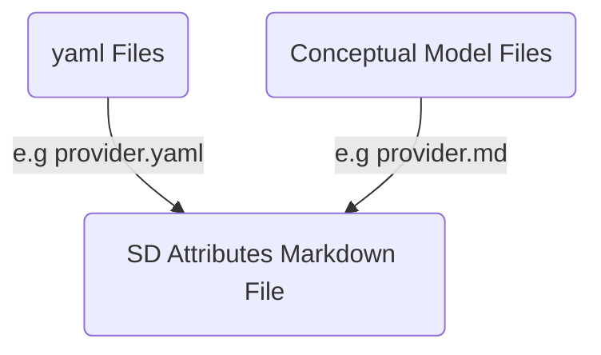

# Tools for Self-Description

We divide the toolchain into end-user tools. The toolchain supports CI/CD Pipeline. End user tools are for users to create and manage self-descriptions. We support the following end user tools:

- Creation Wizard

## End User Tool

### Creation Wizard

The documentation of the creation wizard can be found [here](https://gitlab.com/gaia-x/data-infrastructure-federation-services/self-description-tooling/sd-creation-wizard/sd-creation-wizard-frontend/-/blob/main/README.md)


### Generation of Widoco Documentation

The documentation of all underlying ontology modules ([core](https://www.w3id.org/gaia-x/core), [contract](https://www.w3id.org/gaia-x/contract), [node](https://www.w3id.org/gaia-x/node), [participant](https://www.w3id.org/gaia-x/participant), [resource](https://www.w3id.org/gaia-x/resource), and [service offering](https://www.w3id.org/gaia-x/service)) is fully-automatically generated using [WIDOCO](https://github.com/dgarijo/Widoco). It takes the ontology file(s) as input and creates an html file containing the ontology information and including a visualization using [WebVOWL](vowl.visualdataweb.org/webvowl.html).

An exemplary standalone command-line execution could be:

`java -jar widoco.jar -ontFile ./implementation/ontology/Contract/Contract.ttl -outFolder docContract -webVowl -uniteSections -rewriteAll`

For additional information on the parameters please take a look at the [WIDOCO documentation](https://github.com/dgarijo/Widoco).

See also: [/toolchain/docgen](/toolchain/docgen)

### Validation of Single Source of Truth (Yaml files)

We validate the semantic and syntax of all the yaml files in each commit. 
This is done for quality assurance, such that subsequent events in the pipeline can complete or display coherent information. 

The syntax check is performed by validating each yaml file in [/yaml/]() against a json schema [/single-point-of-truth/yaml/validation/schema.json]().
The script is directly encoded into the gitlab pipeline [file](.gitlab-ci.yml).
For that it uses the [ajv Json validator](https://ajv.js.org/).

The semantic check is performed by the  [check_yaml.py](/toolchain/semantic_validation/) script. It uses python and implements all the constraints listed in the 
Guidelines for writing valid YAML files, which can be found [here](/single-point-of-truth/yaml/README.md).


### Ontology Generation

```shell
python3 ontology_generation/cli.py ontology-generation --srcFile pathFile.csv --dstPath ../yaml2ontology/  -e gax-core -e trusted-cloud -e gax-trust-framework

```

Reads out all yaml files in "yaml/*.yaml" and creates Turtle (*.ttl) files that describe the ontology.

With each commit, the latest version of the ontology is computed. 
The (*.ttl) files are saved to [public/ontology/generated/](public/ontology/generated/).

In more detail, for each prefix (aka. ecosystem) the script generates one ontology file (e.g trusted-cloud.ttl) that describes
all classes associated with this prefix (e.g trustedCloudProvider.yaml', 'participant.yaml', 'provider.yaml').

- Each ontology file starts with a list of prefixes that are used within the ontology file.
- Each ontology file includes a definition of the associated gax-prefix. This information is not included in the *.yaml files.
   Thus, we utilize other files to define this definition. They are located in [toolchain\ontology_generation\prefix_definitions](toolchain\ontology_generation\prefix_definitions) 
- Each gax-prefix definition has a property dct:modified described as a xsd:dateTimeStamp, which is set to the execution time of the script.
- Each ontology file includes a definition of classes (owl:Class). Each owl:Class is defined by one *.yaml file.
- Each definition of a class  includes the class definition itself and a definition of its associated DatatypeProperties (owl:DatatypeProperty).


### Automatic Translation 

We also implement an automatic translation that translates all the yaml files to the specified ouptut language.
Currently, only value of keyword is translated. The keyword is called description and bound to each attribute in a yaml file. 
The reason for this is that we want to support multiple languages in the creation wizzard.

Currently, the script is implemented using [google Trans](https://pypi.org/project/googletrans/). 
Other options free option is [libre translate](https://libretranslate.com/), wheras a paid option would be [deepL](https://www.deepl.com/docs-api).

The scrip uses a CLI. 

-s is the source file, which is a file that specifies paths to configuration files.

-e stands for ecosystem and is the ecosystem. This parameter can be provided as input multiple times to translate multiple ecosystems at once. 

-l is the language tag and can also be provided multiple times. Use standard language abbreviations. E.g de for german and en for english. 
Note, the language tags are library specific and might need to be adjusted if the underlying translation api is changed. 

An example call is provided bellow:

```shell
python3 language_preprocessing/cli.py language_translator -s 'pathFile.csv' -e 'trusted-cloud' -e 'gax-core' -e 'gax-trust-framework' -l 'de' -l 'en' -t "../preprocessed_yaml/"
```


### Creating the SHACL shapes

The 'createShacl' job of the [Gitlab CI pipeline](https://gitlab.com/gaia-x/gaia-x-community/gaia-x-self-descriptions/-/blob/master/.gitlab-ci.yml) automatically creates a SHACL shape for each of the classes defined by the given [YAML files](https://gitlab.com/gaia-x/gaia-x-community/gaia-x-self-descriptions/-/tree/master/yaml). These shapes are *.ttl files and each created shape is named as the YAML file it is based on with an extending "Shape" to the name. E.g.:

Based on the "participant.yaml" file a "participantShape.ttl" file is created.

These SHACL shapes define constraints on certain classes which are used to validate the correctness of [Self Descriptions](https://gaia-x.gitlab.io/technical-committee/architecture-document//self-description/) in the Gaia-X data space. The creation of the SHACL files is done by a [python script](https://gitlab.com/gaia-x/gaia-x-community/gaia-x-self-descriptions/-/blob/master/toolchain/yaml2shacl.py) 
which maps attributes defined in the YAML files to corresponding SHACL properties as defined in the [SHACL Documentation](https://www.w3.org/TR/shacl/). If no corresponding SHACL property exists, properties of other ontologies are used. The table below gives an overview of the currently supported mappings.

| YAML attribute    | SHACL command                 |
|-------------------|-------------------------------|
| title             | sh:name                       |
| description       | sh:description                |
| exampleValues     | skos:example                  |
| minValue          | sh:minInclusive               |
| maxValue          | sh:maxInclusive               |
| valueIn           | sh:in                         |
| length            | sh:minLength / sh:maxLength   |
| cardinality       | sh:minCount / sh:maxCount     |
| pattern           | sh:pattern                    |
| flags             | sh:flags                      |

The resulting SHACL shapes are released as [GitLab Package](https://gitlab.com/gaia-x/technical-committee/service-characteristics/-/packages). For every official Gaia-X Trust Framework release, a new package is released.

### SD Attribute Generator

Reads out yaml files and conceptual model files and concatenates both to a collection of tables with mandatory and optional attributes for each class of Self Description Schema. Tables are written in markdown and places in [/documentation/auto-generated](/deprecated/documentation/auto-generated)



To generate list of attribute tables run

```shell
python3 toolchain/docgen/cli.py sd-attributes --srcYaml yaml --srcConcept conceptual-model --fileName documentation/auto-generated/sd-attributes.md

```

### Validation

The validation of the self descriptions uploaded to this repository is done using [SHACL](https://www.w3.org/TR/shacl/) shapes. These can be found in the [validation directory](https://gitlab.com/gaia-x/gaia-x-community/gaia-x-self-descriptions/-/tree/master/implementation/validation).

The [ci-pipeline](../.gitlab-ci.yml) calls [a tailored python script](./check_shacl.py) which uses [pySHACL](https://github.com/RDFLib/pySHACL) to validate all Self Descriptions against defined SHACL shapes ("schemas"). A standalone command-line execution could be:

`pyshacl -s pathToSHACLFile/shape.ttl -m -i rdfs -a -j -f human pathToSDFile/sd.jsonld`

For additional information on the parameters, please refer to the [pySHACL documentation](https://github.com/RDFLib/pySHACL).


### Visualization

### Constraints

The visualization of the constraints (e.g., mandatory and optional attributes) defined in the SHACL shapes can be found [here](https://gaia-x.gitlab.io/gaia-x-community/gaia-x-self-descriptions/constraints.html). It is created using the tool [shacl-play](https://shacl-play.sparna.fr/play/), which generates UML diagrams from SHACL shapes. 

An exemplary standalone command-line execution could be:

`java -jar shacl-play.jar draw -i implementation/validation/DistributionShape.ttl -o public/constraints/DistributionShape.png`

It takes an SHACL shape as input and generates a PNG File showing the corresponding UML diagram as output.

### Instances

The visualization for JSON-LD instances are available under https://gaia-x.gitlab.io/gaia-x-community/gaia-x-self-descriptions/visualization/instances/.
The exact path to a specific instances is defined by the [location of the instance](../deprecated/implementation/instances/) inside the repository.
For example, the [ACME-Provider](../deprecated/implementation/instances/provider/ACME.jsonld) is visualized [here](https://gaia-x.gitlab.io/gaia-x-community/gaia-x-self-descriptions/visualization/instances/provider/ACME/index.html).

To generate the visualization locally, a Node.js environment is required.
[This script](../toolchain/visualization/build.sh) generates the visualization for all instances.
